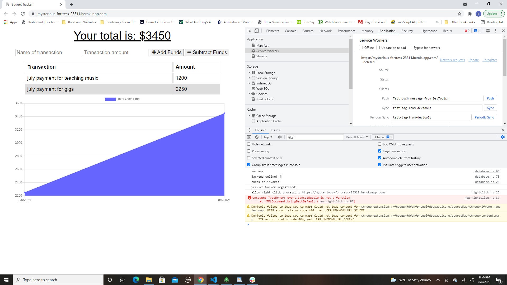
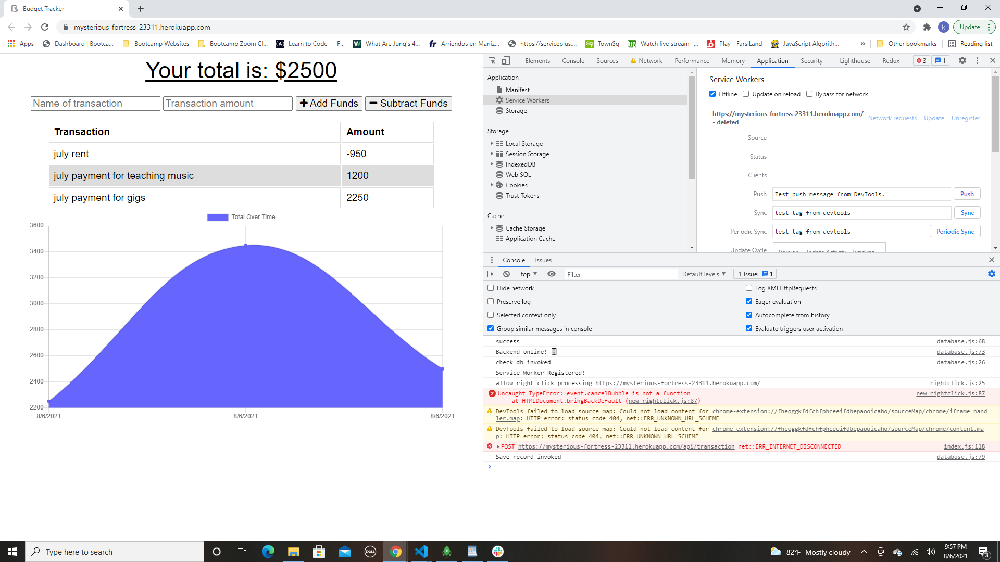
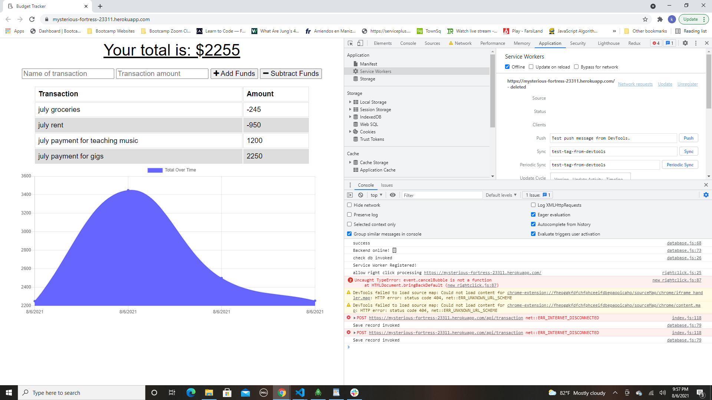
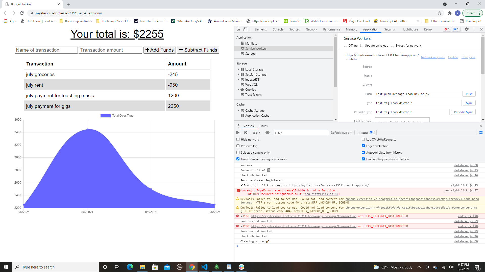

# Progressive-Budget

Visit the Deployed Site Offered by Herokua:

https://mysterious-fortress-23311.herokuapp.com/

# Description

This is an app that helps with tracking your expenses and budget your money coming in and out which you can use online and offline. 

# How To Use

User can visit the website using the url above and just simply start by how much money is coming in and then start subtracting bills and expenses that are coming out.

# Technology Used

- Node.js
- Mongoose
- Javascript
- Heroku
- Service Worker
- Express

# Contact

Any questions or concerns about this app, please contact me:

Github: https://github.com/kaivont85
Email: kaivont@gmail.com

# Screenshots 

ADDED TWO PAYMENTS WHILE ONLINE

INITIAL TRANSACTION AFTER GOING OFFLINE

2 TRANSACTIONS MADE WHILE BEING OFFLINE

CHANGES STAYED AFTER GOING BACK ONLINE AND REFRESHING

GIF OF EVERYTHING FROM START TO FINISH WORKING

